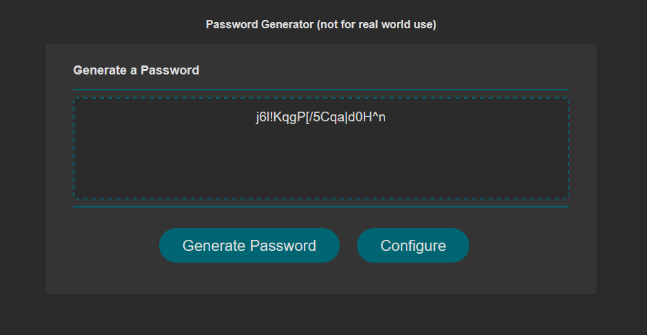
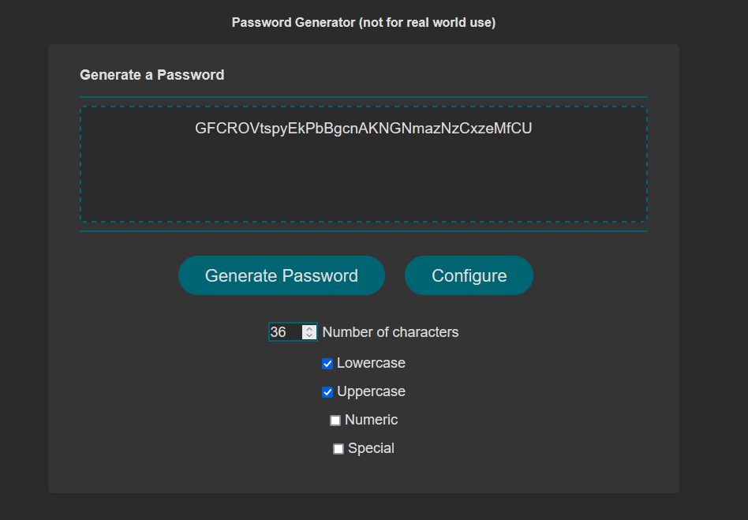

# password-generator

## Description

This webapp generates a password that can be configured by the user. The default configuration is 20 characters long, using lowercase, uppercase, numbers, and special characters, all of which can be changed to user specification.

## Images

### Default behavior

### Configuration options

